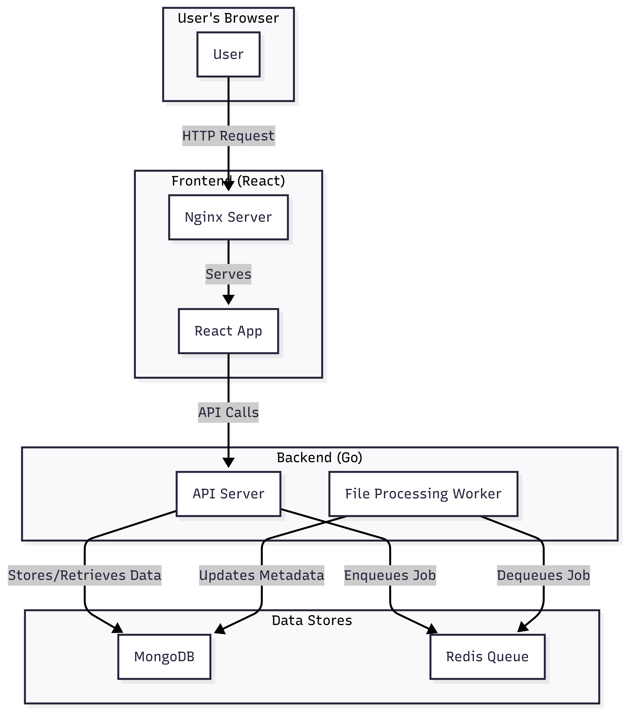

# BoWott: A Document Search and Analysis Platform

BoWott is a web-based application that allows users to upload, search, and analyze documents. It provides a simple and intuitive interface for managing and extracting insights from your files.


### System Components

-   **Frontend:** A React application that provides the user interface. It is served by an Nginx server.
-   **Backend:** A Go application that exposes a REST API for user management, file uploads, and search.
-   **Database:** MongoDB is used to store user data and file metadata.
-   **Queue:** Redis is used as a message queue for asynchronous processing of uploaded files.



## Setup and Running the Project

To set up and run the project, you need to have Docker installed on your system.


1.  **Clone the repository:**

    ```bash
    git clone https://github.com/irishabh96/file-upload-and-search.git
    ```

2.  **Build and run the application:**

    ```bash
    docker-compose up --build -d
    ```

3.  **Access the application:**

    -   Frontend: `http://localhost:3000`
    -   Backend: `http://localhost:8080`

## API Endpoints

The backend provides the following REST API endpoints:

-   `POST /api/register`: Register a new user.
-   `POST /api/login`: Log in an existing user.
-   `POST /api/upload`: Upload a file.
-   `GET /api/files`: Get a list of all files.
-   `GET /api/files/{id}`: Get a specific file by its ID.
-   `GET /api/search?q={query}`: Search for files matching a query.

### Example Queries

-   **Register a new user:**

    ```bash
    curl -X POST -H "Content-Type: application/json" -d '{"username": "testuser", "password": "password123"}' http://localhost:8080/api/register
    ```

-   **Log in:**

    ```bash
    curl -X POST -H "Content-Type: application/json" -d '{"username": "testuser", "password": "password123"}' http://localhost:8080/api/login
    ```

-   **Upload a file:**

    ```bash
    curl -X POST -F "file=@/path/to/your/file.txt" http://localhost:8080/api/upload
    ```

    *List all files:**

    ```bash
    curl http://localhost:8080/api/files
    ```

-   **Search for files:**

    ```bash
    curl http://localhost:8080/api/search?q=test
    ```
